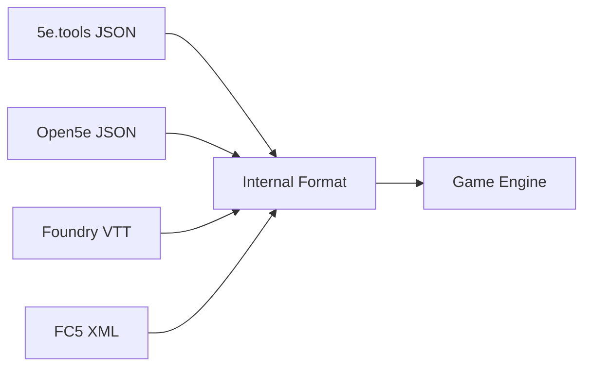

# AI Assistant Development Guide

## 🤖 Welcome AI-Assisted Developers!

This project is specifically designed for efficient AI-assisted development. Whether you're using Antigravity, Cursor, Windsurf, Claude, GPT-4, or GitHub Copilot, this guide will help you contribute effectively.

## Quick Start

### For Antigravity/Cursor/Windsurf Users
1. Open the project root directory
2. The `.ai/project-context.md` file should auto-load
3. Start coding - the AI knows all project conventions!

### For Claude/ChatGPT Users
1. **First Message**: Upload or paste `.ai/project-context.md`
2. **Second Message**: Describe your task
3. The AI will follow all project conventions automatically

### For GitHub Copilot Users
1. The inline XML documentation guides suggestions
2. Check `.github/copilot-instructions.md` for project rules
3. Use comments to guide Copilot: `// Implement IDiceRoller following project conventions`

## Project Philosophy for AI Development

### "Context is King"
We maintain comprehensive context files so AI assistants can generate perfect code on the first try. No more back-and-forth fixing style issues!

### "Tests Define Truth"  
Write tests first, let AI implement. The tests ARE the specification.

### "Interfaces Enable Parallel Work"
Define interfaces, multiple people (or AIs) can implement different parts simultaneously.

## AI Context Files Structure

```
.ai/
├── project-context.md          # PRIMARY - All coding standards (READ FIRST)
├── current-tasks.md           # What we're working on now
├── architecture-decisions.md  # Why things are built this way
├── code-examples.md          # Canonical implementation patterns
└── testing-patterns.md       # How to write tests
```

### Understanding the Context Files

1. **project-context.md** (MANDATORY READING)
   - Coding conventions (MUST follow exactly)
   - Enum patterns with Unspecified/LastValue
   - XML documentation requirements
   - Interface-first design rules
   - Legal constraints (SRD only)

2. **current-tasks.md** (Check for work items)
   ```markdown
   ## In Progress
   - [ ] Implement advantage/disadvantage system (#23)
     - Interface: `IAdvantageProvider`
     - Tests: `Tests/Mechanics/AdvantageTests.cs`
     - Status: Tests written, needs implementation
   ```

3. **architecture-decisions.md** (Understand the "why")
   - Why Result<T> pattern instead of exceptions
   - Why interface-heavy architecture
   - Why separate Core/Implementation projects

## Effective Prompting Strategies

### Starting a New Feature

#### Good Prompt:
```
Following project-context.md conventions, implement the IConcentrationManager interface.
Write comprehensive tests first (TDD), including edge cases for damage thresholds.
Use the standard enum pattern and Result<T> for returns.
```

#### Better Prompt:
```
Task: Implement concentration mechanics
Context: See IConcentrationManager in Core/Interfaces/Magic/
Requirements:
1. Follow TDD - write tests first
2. DC = max(10, damage/2)
3. Return Result<bool> not raw bool
4. Include XML docs on ALL members
5. Test edge cases: 0 damage, negative damage, massive damage
```

### Fixing Bugs

#### Include Context:
```
Bug: Advantage rolls returning lower of two dice
Location: StandardDiceRoller.RollWithAdvantage()
Current test: DiceRollerTests.RollWithAdvantage_ShouldReturnHigher
The test is correct but failing. Fix the implementation.
```

### Adding Content Import

#### Be Specific:
```
Add support for importing from Roll20 format.
1. Create Roll20Importer.cs in Content/Importers/
2. Map Roll20's spell structure to our SpellData
3. Strip all description/flavor text
4. Add to ContentImporterFactory
5. Include test with sample Roll20 JSON in TestData/
```

## AI-Friendly Code Patterns

### Pattern 1: Self-Documenting Interfaces
```csharp
/// <summary>
/// Manages creature hit points and damage calculation
/// </summary>
public interface IHitPointManager
{
    /// <summary>
    /// Applies damage to creature accounting for all modifiers
    /// </summary>
    /// <param name="amount">Base damage before modifiers</param>
    /// <param name="type">Damage type for resistance/immunity check</param>
    /// <returns>Actual damage dealt after all modifiers</returns>
    Result<int> ApplyDamage(int amount, DamageType type);
}
```

### Pattern 2: Test-First Development
```csharp
[Theory]
[InlineData(10, DamageType.Fire, 5)]     // Resistance
[InlineData(10, DamageType.Poison, 0)]   // Immunity  
[InlineData(10, DamageType.Cold, 20)]    // Vulnerability
public void ApplyDamage_WithModifiers_CalculatesCorrectly(
    int baseDamage, DamageType type, int expected)
{
    // This test defines the behavior before implementation exists
}
```

### Pattern 3: Enum Validation
```csharp
public enum ActionType
{
    Unspecified = 0,  // AI: ALWAYS start with this
    Action,
    BonusAction,
    Reaction,
    FreeAction,
    LastValue         // AI: ALWAYS end with this
}

// AI should generate this validation method
public static bool IsValid(ActionType type)
    => type > ActionType.Unspecified && type < ActionType.LastValue;
```

## Common AI Development Workflows

### Workflow 1: Implementing an Interface
1. AI reads the interface definition
2. AI checks for existing tests
3. AI writes missing tests if needed
4. AI implements following all patterns
5. AI ensures all tests pass

### Workflow 2: Adding a New Creature Type
```
Human: Add support for undead creatures
AI Actions:
1. Create IUndead interface in Core/Interfaces/Creatures/
2. Add UndeadType enum with Unspecified/LastValue
3. Write tests for undead-specific mechanics
4. Implement in Implementation/Creatures/
5. Add import support for undead from content files
```

### Workflow 3: Debugging with AI
```
Human: The attack roll isn't applying proficiency bonus
AI Needs:
- The failing test
- The current implementation
- Related interfaces (IAttackRoll, IProficiencyProvider)
AI Should:
- Fix only the specific issue
- Not refactor unrelated code
- Maintain all existing tests passing
```

## Testing with AI Assistants

### The AI Should Know:
- Every public method needs at least 3 tests: happy path, edge case, error case
- Use `Theory` with `InlineData` for parametric tests
- Test method naming: `MethodName_Condition_ExpectedResult`
- Always test enum bounds with Unspecified and LastValue

### Example Test Generation Prompt:
```
Generate comprehensive tests for IDiceRoller.Roll method:
- Valid notation: "3d6+2", "1d20", "4d4-1"
- Invalid notation: "", "abc", "1d0", "0d6"
- Edge cases: "1d1", "100d100", negative modifiers
- Use Theory/InlineData for all cases
```

## Content Import Development

### Understanding the Approach
We support multiple formats but convert everything to our clean internal representation:



### When AI Implements an Importer:
1. Never import description/flavor text
2. Only extract mechanical effects
3. Map to our clean internal format
4. Mark the source format for tracking
5. Don't validate legality (user's responsibility)

### Example Importer Prompt:
```
Create importer for D&D Beyond JSON format:
1. Class: DndBeyondImporter : IContentImporter
2. Parse their spell structure
3. Extract: name, level, school, range, components
4. Ignore: description, flavor_text, source_book
5. Map components: "V,S,M" -> Components(Verbal=true, Somatic=true, Material=true)
6. Test with sample JSON from TestData/
```

## Code Generation Best Practices

### DO:
- ✅ Always include XML documentation
- ✅ Follow the exact enum pattern (Unspecified/LastValue)
- ✅ Use Result<T> for public APIs
- ✅ Write tests before implementation
- ✅ Use underscore prefix for private fields
- ✅ Validate inputs with guard clauses
- ✅ Keep interfaces in Core project only

### DON'T:
- ❌ Skip XML docs ("it's obvious")
- ❌ Use proprietary D&D terms
- ❌ Include spell/monster descriptions
- ❌ Throw exceptions from public methods
- ❌ Put implementation in Core project
- ❌ Create enums without sentinels
- ❌ Use 'var' except for obvious types

## Advanced AI Techniques

### Technique 1: Chain of Thought for Complex Features
```
Implement combat initiative system:
1. First, I need to understand the requirements
2. Check existing interfaces: ICombatManager, IInitiativeTracker
3. Write tests for: roll initiative, sort order, ties, advantages
4. Implement following Result<T> pattern
5. Integrate with existing TurnManager
```

### Technique 2: Incremental Implementation
```
Human: Implement spell slots system
AI: I'll implement this incrementally:
1. First PR: ISpellSlotManager interface
2. Second PR: Basic implementation with tests  
3. Third PR: Multiclass support
4. Fourth PR: Warlock pact slots
This allows for review and feedback at each stage.
```

### Technique 3: Reference Implementation Pattern
```
Human: How should I implement conditions?
AI: Check the existing implementation pattern:
- BuffManager uses IEffect with duration
- StatusEffect class shows the pattern
- Follow the same approach for conditions
- See Tests/Effects/BuffTests.cs for test patterns
```

## Troubleshooting AI-Generated Code

### Issue: AI Ignoring Project Conventions
**Solution**: Always start conversation with:
```
I'm working on OpenCombatEngine. 
CRITICAL: Follow all conventions in project-context.md exactly.
[Then describe your task]
```

### Issue: AI Creating Wrong Project Structure
**Solution**: Be explicit about file locations:
```
Create the interface in: src/OpenCombatEngine.Core/Interfaces/Combat/IInitiative.cs
Create the tests in: tests/OpenCombatEngine.Core.Tests/Combat/InitiativeTests.cs
Create the implementation in: src/OpenCombatEngine.Implementation/Combat/StandardInitiative.cs
```

### Issue: AI Missing Edge Cases in Tests
**Solution**: Prompt for specific test categories:
```
Generate tests for these categories:
1. Happy path (normal usage)
2. Boundary conditions (min/max values)
3. Invalid inputs (null, negative, out of range)
4. Edge cases specific to D&D rules
```

## Contributing Your AI Improvements

### Found a Better Pattern?
1. Test it thoroughly
2. Document it in `.ai/code-examples.md`
3. Submit PR with rationale

### Improved a Prompt?
Share it! Add to `.ai/effective-prompts.md`

### Created a New Context File?
Place in `.ai/` directory and document its purpose

## Tool-Specific Tips

### Antigravity
- **Best For**: Full implementation of entire features
- **Tip**: Let it read all context files at project open
- **Strength**: Maintains context across entire session

### Cursor/Windsurf
- **Best For**: Rapid iteration on specific files
- **Tip**: Use comments to guide generation
- **Strength**: Excellent at following patterns in current file

### Claude Desktop
- **Best For**: Architecture discussions and design
- **Tip**: Attach project-context.md to every conversation
- **Strength**: Understands complex requirements

### GitHub Copilot
- **Best For**: Line-by-line code completion
- **Tip**: Write descriptive comments first
- **Strength**: Follows existing patterns in file

### GPT-4
- **Best For**: Explaining complex algorithms
- **Tip**: Provide explicit context about project standards
- **Strength**: Good at generating comprehensive tests

## Performance Tips

### 1. Batch Related Changes
Instead of: "Add a method to ICreature"
Do: "Add these related methods to ICreature: Attack(), Defend(), TakeDamage()"

### 2. Provide Examples
Instead of: "Follow project patterns"
Do: "Follow the pattern used in BuffManager.ApplyBuff()"

### 3. Reference Existing Code
Instead of: "Implement like other managers"
Do: "Implement like SpellManager.cs lines 45-67"

## Legal Compliance Reminder

When generating content-related code:
- ✅ Use SRD terms only
- ✅ Generic names (not "Beholder", use "ManyEyedCreature")
- ✅ Mechanical effects only (no flavor text)
- ✅ Let users import their own content
- ❌ Never generate copyrighted descriptions
- ❌ Never use "D&D" or "Dungeons & Dragons"

## Getting Help

1. **Check Context Files**: Answer might be in `.ai/` directory
2. **Read Tests**: Tests often explain intended behavior
3. **Look at Examples**: `examples/` directory has working code
4. **Ask in Issues**: Tag with `ai-development` label

## Final Tips

1. **Trust the AI but Verify**: AI can make mistakes, always review
2. **Tests Don't Lie**: If tests pass, the code is probably correct
3. **Context Prevents Bugs**: Good context = fewer iterations
4. **Share Your Learnings**: Help others with your discoveries

---

*Remember: The goal is to make AI-assisted development so smooth that it feels like the AI is a team member who's been on the project since day one!*
